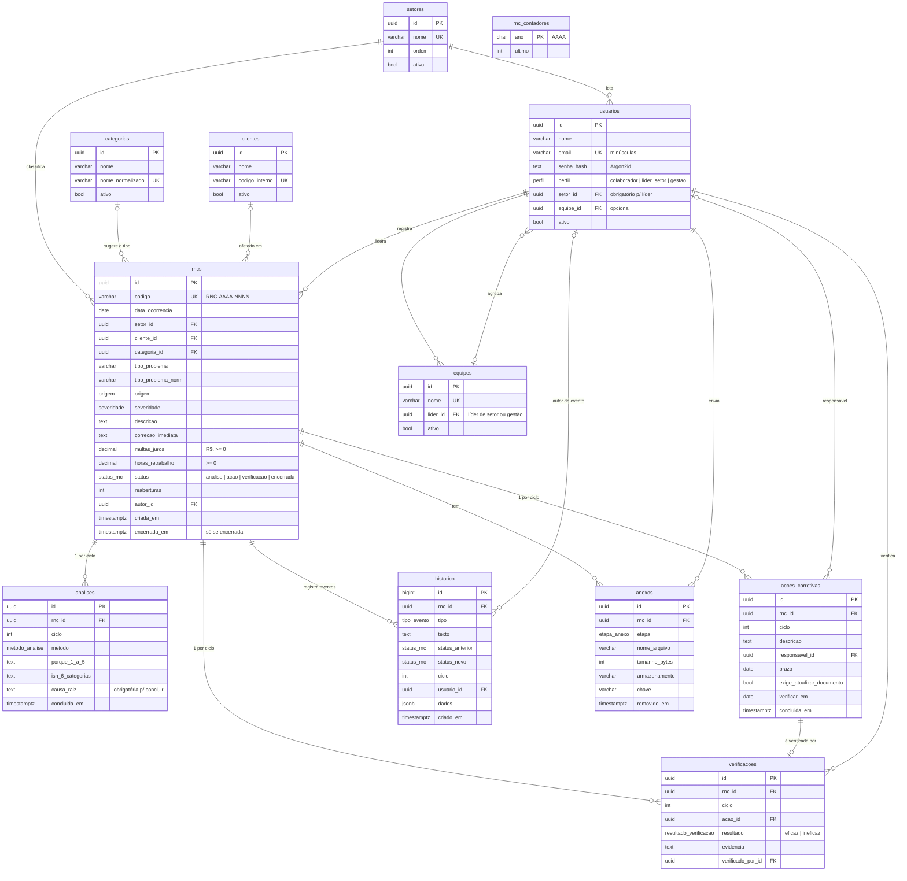

# Modelo de dados

PostgreSQL, gerenciado pelo Prisma (`prisma/schema.prisma`). Nomes de tabelas e colunas em português, `snake_case` no banco.

## Ciclos e reabertura

Cada passagem por análise → ação → verificação é um **ciclo** (`ciclo = reaberturas + 1`). `analises`, `acoes_corretivas` e `verificacoes` têm uma linha por ciclo (`UNIQUE (rnc_id, ciclo)`).

Quando a verificação é **ineficaz**, a RNC volta para `analise`, `reaberturas` aumenta em 1 e começa um novo ciclo com análise em branco. A causa raiz e a ação do ciclo anterior continuam gravadas.

## Regras garantidas pelo banco

| Regra | Como |
|---|---|
| Status, severidade, origem, perfil, método e resultado válidos | ENUMs do PostgreSQL |
| `encerrada` ⇔ `encerrada_em` preenchida | CHECK `rncs_encerramento_ck` |
| Código no formato `RNC-AAAA-NNNN` | CHECK `rncs_codigo_formato_ck` |
| Multas, horas e reaberturas não negativas | CHECKs em `rncs` |
| Análise só conclui com causa raiz | CHECK `analises_conclusao_ck` |
| Ação só conclui com descrição, responsável e data de verificação | CHECK `acoes_corretivas_conclusao_ck` |
| Líder de setor precisa ter setor | CHECK `usuarios_lider_tem_setor_ck` |
| Histórico só aceita INSERT | Trigger `historico_somente_insercao` (bloqueia UPDATE, DELETE e TRUNCATE) |
| RNC com histórico não pode ser apagada | FK `ON DELETE RESTRICT` |

A ordem das transições (análise → ação → verificação → encerrada, ou de volta à análise) envolve mais de uma tabela. Ela é garantida na camada de serviço da aplicação e coberta por testes automatizados (etapa 4).

`npm run db:check` confere todas essas regras contra o banco configurado no `.env`.

## Índices para lista e painel

- `rncs`: `status`; `(setor_id, status)`; `(severidade, status)`; `criada_em DESC`; `encerrada_em`; `data_ocorrencia`; `(setor_id, tipo_problema_norm, criada_em)` para reincidência e problemas recorrentes; `cliente_id`; `autor_id`.
- `acoes_corretivas`: `(concluida_em, prazo)` para prazos vencidos e lembretes; `verificar_em` para verificações liberadas; `(responsavel_id, concluida_em)` para "minhas ações".
- `historico`: `(rnc_id, criado_em)`.
